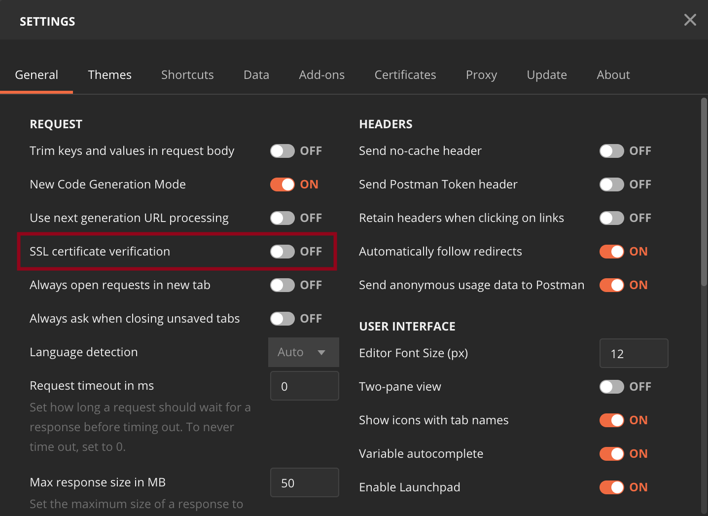
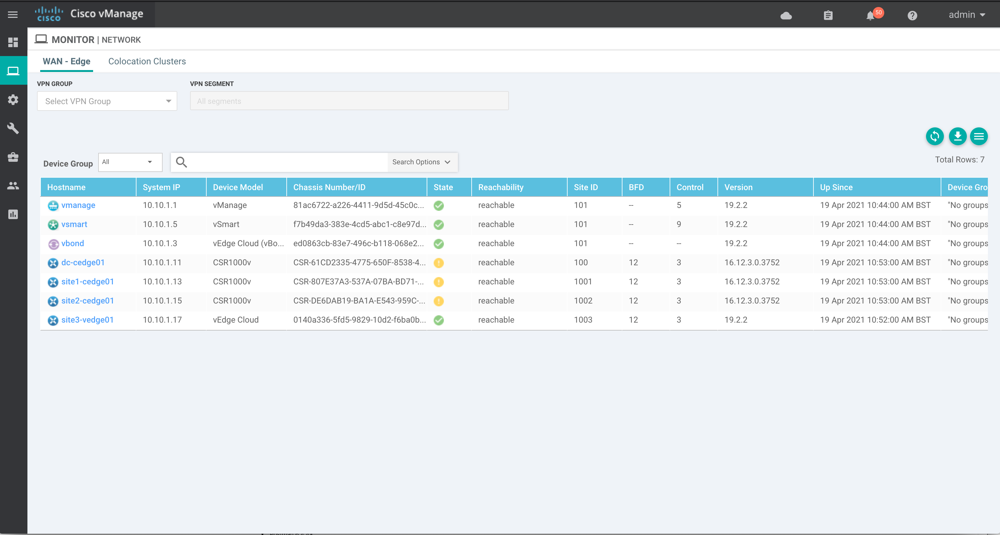
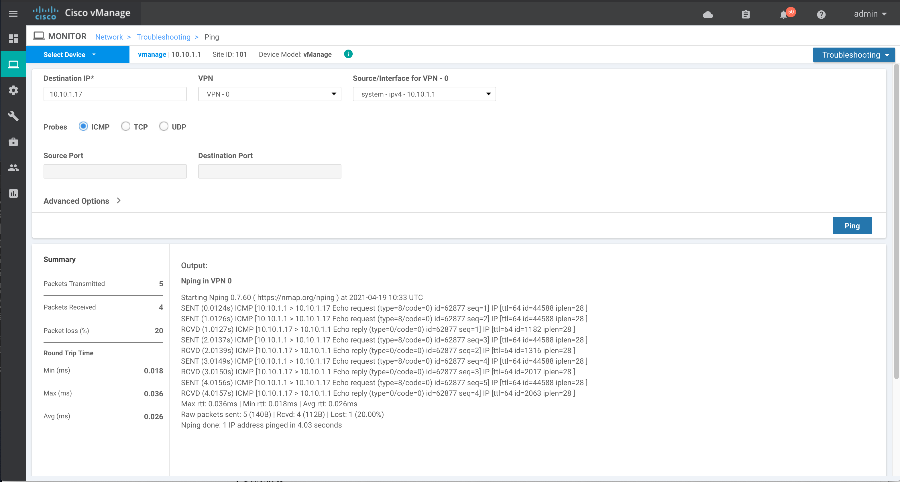
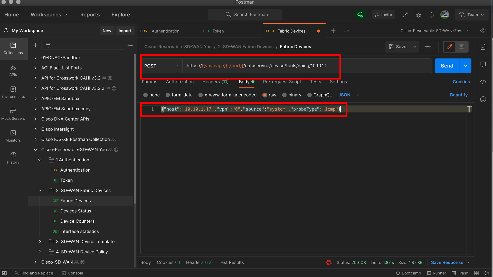
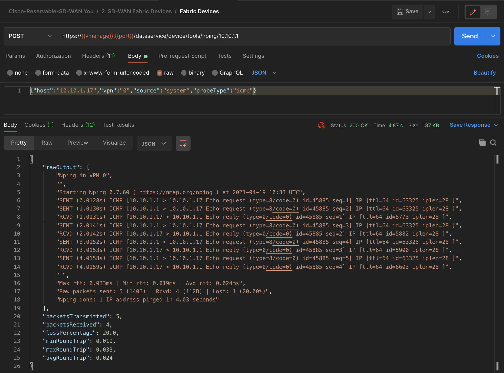

# Postman for Cisco SD-WAN

This public repo using the [POSTMAN](https://getpostman.com) environment and collection that can be used to interact with the `Cisco SD-WAN vManage REST API`. This can be downloaded [Here from DevNet Code Exchange](https://developer.cisco.com/codeexchange/github/repo/CiscoDevNet/Postman-for-Reservable-Cisco-SD-WAN)

The environment is pre-configured to access the [Cisco DevNet Reservable Sandbox for SD-WAN](https://devnetsandbox.cisco.com/RM/Diagram/Index/c9679e49-6751-4f43-9bb4-9d7ee162b069?diagramType=Topology) fabric. You can edit the variables in the environment to point to your own vManage instance. The collection contains REST API calls to authenticate, get a list of devices that are part of the SD-WAN fabric, and get device status, counters, and interface statistics for all the interfaces in the fabric. Feel free to modify them as you see fit and to add more calls to the collection.


# Requirements

The Postman collection and environment will need:
* Postman 6.4.4+
* Cisco SD-WAN vManage 19.2.2

# Setup

If you don't have Postman already installed, you can download it from [here](https://getpostman.com). Once you install it, you can follow the steps below to import the collection and environment:


1. Click on `Import`, browse to the location where you cloned this repo and add the two files:
    1. `Cisco-Reservable-SD-WAN-Env.postman_environment`
    2. `Cisco-Reservable-SD-WAN.postman_collection.json`
2. Make sure you select the `Cisco-Reservable-SD-WAN-Environment` environment
3. Expand the collection and start making REST API calls.

## Note: In case your instance of vManage has a self signed certificate, make sure you disable `SSL certificate verification` in Postman's settings.

To disable SSL certificate verification go to Settings, click on switcher as in the screenshot below



# Using the ping API

To verify that a device is reachable on the network, ping the device to send ICMP ECHO_REQUEST packets to it:

From the Monitor -> Network screen, select the device (in this example vManage used to send ping to site3-vedge01 (10.10.1.17)



Here you can see this example in the UI. Using the source interface of system-ipv4-10.10.1.1 which is the vManage system IP address (see previous screen shot)



To perform this same task in the API, first run the Authetication and Token API calls from the Postman collection. Once this is done update the request with the following `POST` request. This uses the source `10.10.1.1` which is the vManage system IP address
(replacing the example with your own details if required)


```
https://{{vmanage}}:{{port}}/dataservice/device/tools/nping/10.10.1.1
```

In the Body tab of the request editor, select the raw option, and then select `JSON` in the dropdown that appears to the right of the options. Put the following `JSON` payload in the text field for our body, (replacing the example with your own details if required). 

- The Destination IP field, enter the IP address of the device to ping.
- The VPN drop-down, select the VPN to use to reach the device.
- The Source/Interface drop-down, select the interface to use to send the ping packets.
- The Probes field, select the protocol type to use to send the ping packets.

```
{"host":"10.10.1.17","vpn":"0","source":"system","probeType":"icmp"}
```



If this was a sucess you will see the following output. If there is an error HTTP 415 Unsupported Media Type client error response code, this indicates that the server/vManage refuses to accept the request because the payload format is in an unsupported format. Check your payload and format.




## About me

Network Automation Developer Advocate for Cisco DevNet.


Find me here: [LinkedIn](https://www.linkedin.com/in/stuarteclark/) / [Twitter](https://twitter.com/bigevilbeard)